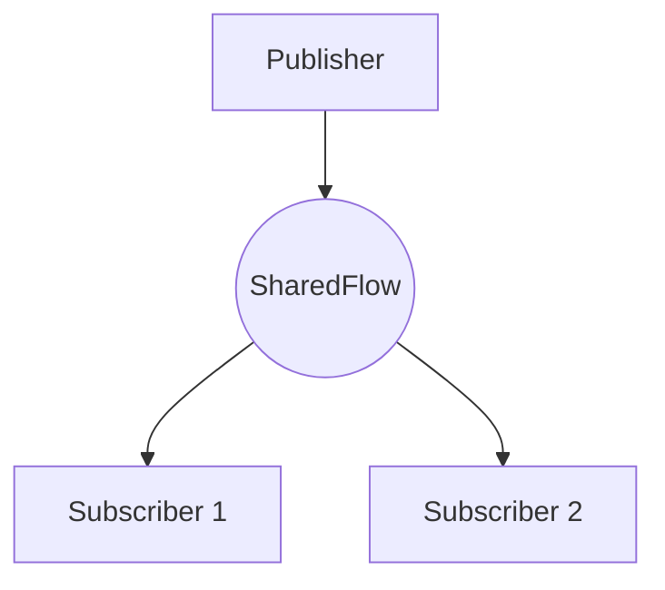
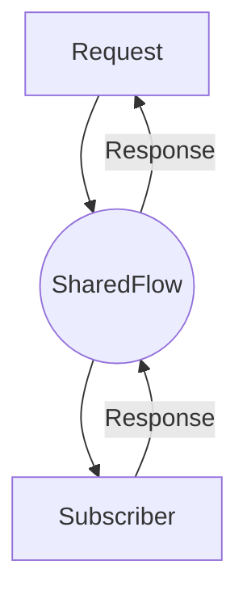

# Ktbus

A simple EventBus implementation based on Kotlin SharedFlow and inspired by 
[Greenrobot EventBus](https://github.com/greenrobot/EventBus).

## Build


## Concept and Usages

### Setup

Use MavenCentral in `settings.gradle.kts`:

```kotlin
repositories {
    mavenCentral()
}
```

Include in application `build.gradle.kts`:

```kotlin
dependencies {
    implementation("org.holance:ktbus:{version}")
}
```

Make sure to replace `{version}` with the version of the library.

### Publish/Subscribe



#### Example

```kotlin
data class Event1(val value: Int)
data class Event2(val value: Int)
data class Event3(val value: Int)

class SomeClass {
    val bus = KtBus.getDefault()

    fun setup() {
        bus.subscribe(this)
    }

    fun tearDown() {
        bus.unsubscribe(this)
    }

    @Subscribe
    fun onEvent1(event: Event1) {
        // Do something with the event
    }

    @Subscribe(scope = DispatcherTypes.IO)
    fun onEvent2(event: Event2) {
        // Do something with the event in a IO coroutine scope
    }

    @Subscribe
    fun onEvent3(event: Event3) {
        // Do something with the event
    }
}

val bus = KtBus.getDefault()

bus.post(Event1(1))
bus.post(Event2(2))
bus.post(Event3(3))
```


### Request/Response



#### Example

```kotlin

data class ComputeSquareEvent(val value: Int)
data class ComputeSquareResult(val value: Int)

class MathClass {
    val bus = KtBus.getDefault()
    fun setup() {
        bus.subscribe(this)
    }
    fun tearDown() {
        bus.unsubscribe(this)
    }
    @Subscribe
    fun handleRequest(event: Request<ComputeSquareEvent, ComputeSquareResult>) {
        // Process event and create a response with type Event2
        event.setResult(ComputeSquareResult(event.data.value * event.data.value))
    }
}

val bus = KtBus.getDefault()

bus.request<ComputeSquareEvent, ComputeSquareResult>(ComputeSquareEvent(5)) { result: Response<ComputeSquareResult> ->
    when (result) {
        is Response.Success -> {
            assert(result.data.value == 25)
        }
        is Response.Error -> {
            println("Error: ${result.error}")
        }
        is Response.Timeout -> {
            println("Timeout")
        }
    }
}
```

### Use Channel

#### Compile time Channel

```kotlin
data class SomeEvent(val value: Int)

class SomeClass {
    val bus = KtBus.getDefault()
    
    fun setup() {
        bus.subscribe(this)
    }
    
    fun tearDown() {
        bus.unsubscribe(this)
    }
    
    @Subscribe(channel = "channel1")
    fun handleEventFromChannel1(event: SomeEvent) {
        // Do something with the event
    }

    @Subscribe(channel = "channel2")
    fun handleEventFromChannel2(event: SomeEvent) {
        // Do something with the event
    }

    @Subscribe(channel = "channel3")
    fun handleEventFromChannel3(event: SomeEvent) {
        // Do something with the event
    }
}

val bus = KtBus.getDefault()

bus.post(SomeEvent(1), "channel1")
bus.post(SomeEvent(2), "channel2")
bus.post(SomeEvent(3), "channel3")
```

#### Runtime Channel

```kotlin
data class SomeEvent(val value: Int)

class SomeClass(val channel: String) {
    class SomeChannelFactory : ChannelFactory {
        override fun getChannel(obj: Any): String {
            return (obj as? SomeClass)?.channel ?: DefaultChannelFactory.DEFAULT_CHANNEL
        }
    }
    
    val bus = KtBus.getDefault()
    
    fun setup() {
        bus.subscribe(this)
    }
    
    fun tearDown() {
        bus.unsubscribe(this)
    }
    
    @Subscribe(channelFactory = SomeChannelFactory::class)
    fun handleEvent(event: SomeEvent) {
        // Do something with the event
    }
}

val objCh1 = SomeClass("channel1")
objCh1.setup()

val bus = KtBus.getDefault()

bus.post(SomeEvent(1), "channel1")
```
